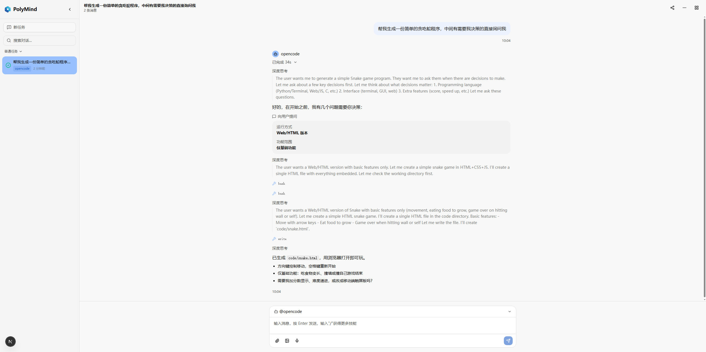
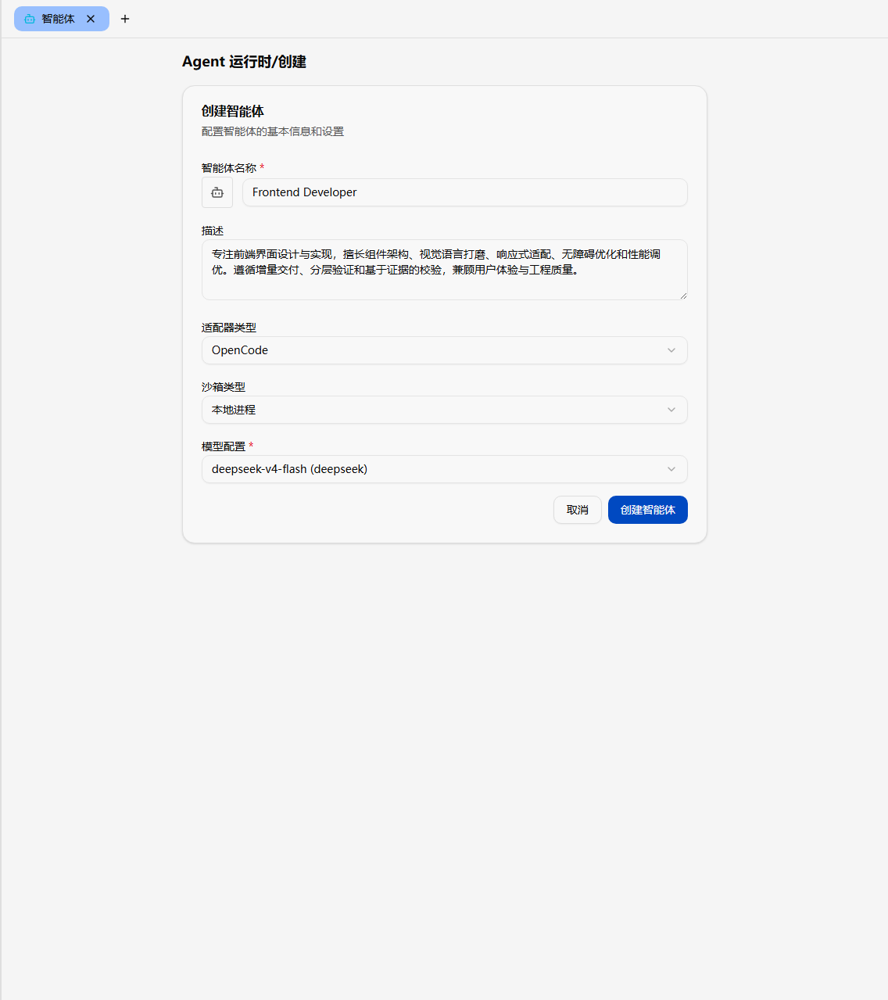
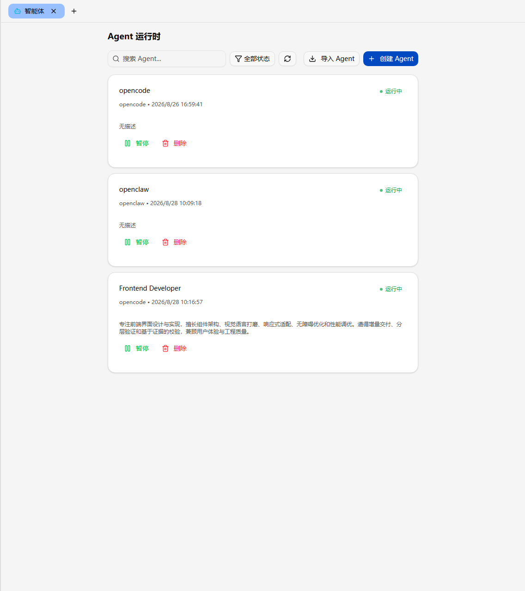
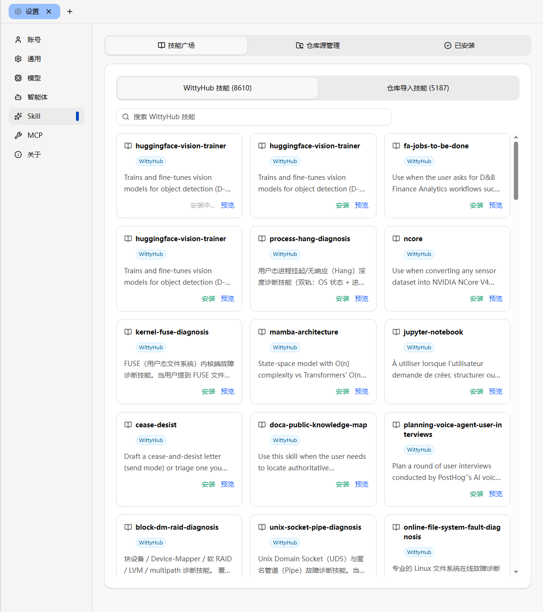
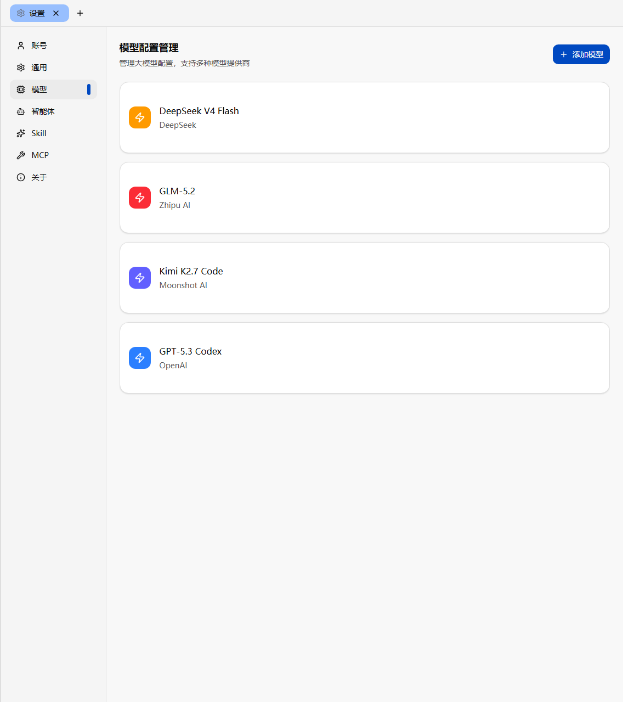
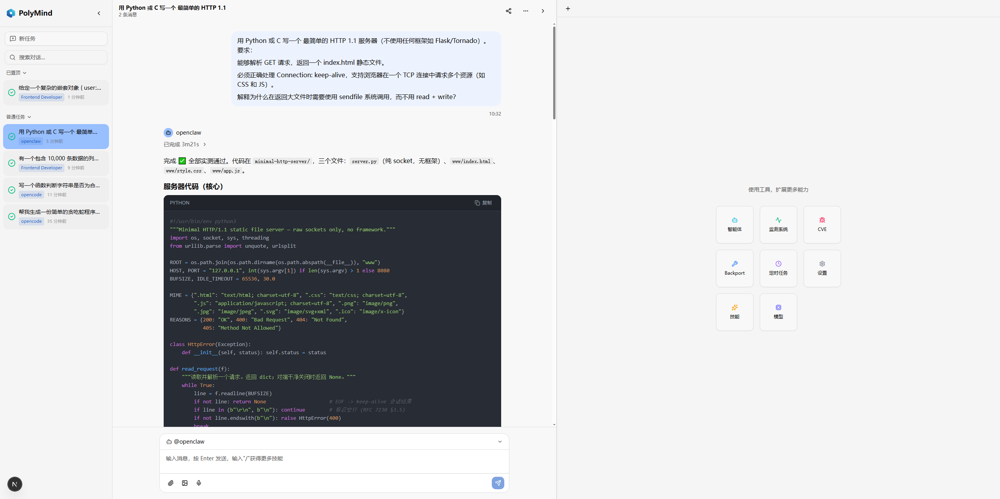

# PolyMind 用户指南

> **文档更新时间**：2026-08-26
>
> **目标读者**：运维工程师、系统管理员、自托管 AI Agent 平台使用者


## 引言

### 产品概述

PolyMind 是一个原生集成 agentd 服务的自托管 AI Agent 交互平台。它将 AI 对话、Agent 工作流编排与多模型管理融为一体，通过 agentd 服务统一调度 LLM、MCP 服务与 Agent，实现多模态认知协作与自主决策。你可以将 PolyMind 视为一个"AI Agent 的控制台"：创建 Agent → 在隔离沙箱中运行 → 通过对话交互 → 管理其生命周期。

本指南将带你完成从安装、配置、启动到核心功能使用与故障排查的全流程。若只需快速跑通，请参见 [安装 PolyMind](#安装-polymind)。

### 核心特性

- **原生 agentd 集成**：通过 agentd 服务管理 Agent 的完整生命周期（创建、沙箱运行、暂停/恢复），支持 OpenCode、OpenClaw、Claude Code 等多种 Adapter
- **智能对话**：持久化多会话管理，支持 Markdown 渲染、代码高亮、数学公式（KaTeX）、流程图（Mermaid）等富文本展示
- **技能市场**：内置技能仓库管理，支持从市场安装、上传自定义技能包，为 Agent 注入专业能力
- **多模型管理**：统一配置和切换不同 AI 模型提供商，灵活适配业务需求
- **分面板工作区**：可调整大小的分面板布局，同时查看对话与工具面板，适配多种使用场景
- **安全认证**：基于 Token 的身份认证机制，保障 API 接口访问安全
- **开箱即用**：作为独立 npm 包分发，一条命令完成安装和启动

### 技术架构

| 层级 | 技术栈 |
|------|--------|
| 前端框架 | Next.js 16 + React 19 |
| 语言 | TypeScript 5.7 |
| UI 组件 | shadcn/ui + Radix UI |
| 样式方案 | Tailwind CSS 4 |
| 状态管理 | Zustand 5 |
| 图表可视化 | Recharts |

PolyMind 采用前后端分离架构，通过 nginx 反向代理统一入口：

```text
浏览器
   │
   ▼
nginx（端口 3000，反向代理）
   ├── /          → Next.js 前端（内部端口 3001）
   └── /api/*     → witty-service 后端（端口 8000）
```
## 前置条件

### 硬件要求

| 项目 | 最低要求 | 推荐配置 |
|------|----------|----------|
| 内存 | 4 GB | 8 GB 及以上 |
| 磁盘 | 20 GB | 50 GB 及以上（含 Agent 沙箱工作区） |
| 网络 | 稳定网络即可；安装时可访问依赖镜像源（pnpm/pip/nvm，默认使用国内镜像），运行时按需访问模型 API |  100 Mbps 及以上 |
| 架构 | AArch64 或 x86_64 | 与业务服务器一致 |

### 软件与系统要求

| 依赖 | 最低版本 | 说明 |
|------|----------|------|
| 操作系统 | Linux | 仅支持 Linux |
| Node.js | 22 | 由 install-local.sh 通过 nvm 自动安装 |
| pnpm | 11 | 由 install-local.sh 自动安装 |
| Python | 3.11 | 用于 witty-service 后端 venv |
| nginx | 任意 | PolyMind 必需的反向代理 |
| Docker | 任意（20.10+） | Agent 沙箱运行时，由 install-local.sh 自动安装并预拉取镜像 |
| opencode | 1.17.20 | Agent Adapter CLI，由 install-local.sh 自动安装 |
| git | 任意 | 下载 nvm 时必需 |

> [!NOTE]说明
> 上述依赖除 git 外，`install-local.sh` 都会自动安装。如果系统已有满足版本要求的依赖，脚本会跳过重复安装。安装 nginx、Docker 以及写入 `/etc/docker/daemon.json` 时需要 **sudo 权限**。

---

## 安装 PolyMind

### 安装前准备

PolyMind 提供两种安装方式，请根据你的场景选择：

| 安装方式 | 适用人群 | 特点 |
|----------|----------|------|
| 一键脚本安装（`install-local.sh`） | 非开发人员、快速部署 | 自动完成依赖检测、环境隔离与安装，推荐 |
| npm 全局安装（`polymind`） | 已自行部署 agentd 后端 | 仅安装前端，需自行配置后端 |

> [!TIP]须知
> 一键脚本方式会安装**完整解决方案**（前端 polymind + 后端 witty-service + Agent 运行时 openclaw/opencode + Docker 沙箱运行时 + nginx 反向代理），无需预先部署 agentd。若你已自行部署 agentd 后端服务，则可选择 npm 方式仅安装前端。

### 方式一：一键脚本安装（推荐）

一键脚本会自动完成环境检测、依赖安装与环境隔离，适合非开发人员快速部署。

**Step 1：克隆仓库**

```bash
git clone https://atomgit.com/openeuler/polymind.git
cd polymind

# 预期输出（版本因时点而异）：
# Cloning into 'polymind'...
# remote: Enumerating objects: 457, done.
```

**Step 2：运行安装脚本**

```bash
bash install-local.sh

# 脚本会自动执行：
# 0/4  系统环境探测 —— 检查操作系统、架构、Node.js、pnpm、Python、pip
# 1/4  运行时依赖安装 —— 安装 Node.js 22 LTS、pnpm 11、Python 3.11+、nginx、Docker（含镜像加速器配置、docker 用户组、守护进程启动与沙箱镜像预拉取）
# 2/4  环境隔离初始化 —— 创建 Python venv，生成独立环境配置文件
# 3/4  应用包安装 —— 安装 polymind、witty-service、openclaw、opencode-ai
# 4/4  安装验证 —— 验证所有组件（含 Docker、opencode）是否正确安装
```

> [!NOTE]说明
> 安装过程会通过 `sudo` 安装 nginx 与 Docker、写入 `/etc/docker/daemon.json` 并将当前用户加入 docker 组，请确保执行脚本的用户具有 sudo 权限（脚本会交互式提示输入密码）。

脚本还支持以下可选参数：

```bash
# 自定义 pnpm 镜像源（国内网络加速场景）
bash install-local.sh --pnpm-mirror https://registry.npmmirror.com

# 自定义 pip 镜像源
bash install-local.sh --pip-mirror https://pypi.tuna.tsinghua.edu.cn/simple

# 显示详细输出
bash install-local.sh --verbose
```

**Step 3：确认安装摘要**

安装完成后，脚本会输出安装摘要：

```text
============================================
  PolyMind 安装完成!
============================================

  安装目录:  ~/.polymind
  环境配置:  ~/.polymind/.profile
  应用配置:  ~/.polymind/.env
  安装日志:  ~/.polymind/install.log

  启动服务:  bash start.sh

  ⚠ Docker 用户组:
    Docker 守护进程已启动，但当前会话无访问权限
    请重新登录终端使其生效，或执行: newgrp docker
    然后运行: bash start.sh
```

> [!NOTE]说明
> 若当前会话已能直接访问 Docker（例如以 root 运行，或 docker 组成员身份已生效），则不会显示"Docker 用户组"提示。

> [!WARNING]风险提示
> 安装脚本会将组件安装到 `~/.polymind` 隔离目录，不会污染系统全局环境。但安装 nginx、Docker 及写入 `/etc/docker/daemon.json` 时需要 sudo 权限；如果系统已有旧版 Node.js/pnpm，请确保版本满足要求（Node.js ≥ 22、pnpm ≥ 11），否则脚本可能安装失败。

### 方式二：npm 全局安装

如果已自行部署 agentd 后端服务，可仅安装前端：

```bash
# 使用 npm 全局安装
npm install -g polymind

# 预期输出（版本因时点而异）：
# added 1 package in 5s
```

也可以使用 pnpm 或 yarn：

```bash
pnpm add -g polymind
# 或
yarn global add polymind
```

> [!NOTE]说明
> npm 方式安装后，你需要自行确保 `NEXT_PUBLIC_AGENTD_API_URL` 指向已部署的 agentd 后端地址。安装目录为全局 node_modules，环境隔离能力较弱，建议生产环境使用一键脚本方式。

### 安装后验证

无论采用哪种方式，安装完成后都应验证组件是否就绪（预期输出版本号因时点而异）：

#### 验证前端

```bash
polymind --version
```

#### 预期输出

```bash
1.1.5
```

#### 验证后端（一键脚本方式）

```bash
witty-service --version
```

#### 预期输出

```bash
witty-service 0.10.1
```

#### 验证 Agent 运行时（一键脚本方式）

```bash
openclaw --version
```

#### 预期输出

```bash
2026.6.10
```

#### 验证 OpenCode CLI（一键脚本方式）

```bash
opencode --version
```

#### 预期输出

```bash
1.17.20
```

#### 验证反向代理

```bash
nginx -v
```

#### 预期输出

```bash
nginx version: nginx/1.24.0
```

#### 验证 Docker 沙箱运行时（一键脚本方式）

```bash
docker --version

# 确认沙箱镜像已预拉取（预期输出因时点而异）
docker images | grep witty-agent-server
```

> [!TIP]验证提示
> 若使用一键脚本安装，需先激活隔离环境再验证：
> ```bash
> source ~/.polymind/.profile
> ```
> Docker 与沙箱镜像（`ghcr.io/openwitty/witty-agent-server:openclaw`/`:opencode`）由安装脚本自动准备，无需手动拉取。

### 配置项说明

PolyMind 使用 `~/.polymind/.env` 作为全局配置文件，首次运行时自动生成。安装完成后编辑该文件即可调整配置。

#### 核心配置项

| 配置项 | 说明 | 默认值 |
|--------|------|--------|
| `NEXT_PUBLIC_AGENTD_API_URL` | agentd 后端 API 地址 | `http://127.0.0.1:8000` |
| `NEXT_PUBLIC_WS_URL` | WebSocket 连接地址 | `ws://127.0.0.1:8000/ws` |
| `NEXT_PUBLIC_API_TIMEOUT` | API 请求超时时间（毫秒） | `120000` |
| `NEXT_PUBLIC_AUTH_TOKEN` | API 访问认证 Token | `dev-token` |
| `NEXT_PUBLIC_APP_NAME` | 应用名称 | `PolyMind` |
| `NEXT_PUBLIC_DEBUG` | 调试模式 | `false` |
| `NEXT_WITTYHUB_API_URL` | WittyHub 技能广场 API 地址 | `http://127.0.0.1:8081` |

#### 连接与重试配置

| 配置项 | 说明 | 默认值 |
|--------|------|--------|
| `NEXT_PUBLIC_MAX_RECONNECT_ATTEMPTS` | WebSocket 最大重连次数 | `5` |
| `NEXT_PUBLIC_RECONNECT_INTERVAL` | 重连间隔（毫秒） | `3000` |

> [!TIP]配置建议
> - **生产环境务必修改** `NEXT_PUBLIC_AUTH_TOKEN` 默认值，使用强随机字符串（至少 32 位，含大小写字母、数字、特殊字符），防止未授权访问。
> - `NEXT_PUBLIC_API_TIMEOUT` 设为 `120000`（120 秒）可避免 Agent 长任务执行时连接被提前断开；若你的 Agent 任务普遍超过 2 分钟，可适当调大。
> - 修改 `.env` 后需重启服务才能生效。

#### Insight 观测能力

- `监测系统` 面板的数据由 `witty-service` 的 `/insight/*` 聚合接口提供。
- `polymind` 前端本身不需要额外配置 Insight 专项环境变量，也不会直连 raw `witty-insight`。
- 如果监测系统不可用，请优先检查 `witty-service` 是否已启用 Insight 集成，以及它是否能够访问 `witty-insight`。

### 非 root 用户注意事项

安装脚本与启动脚本面向普通用户设计，但以下步骤需要 **sudo 权限**：

- 安装 nginx、Docker（通过 dnf/yum/apt-get 或 Docker 官方脚本）
- 写入 `/etc/docker/daemon.json`（配置镜像加速器，仅在该文件不存在时创建）
- 将当前用户加入 docker 组（`sudo usermod -aG docker $USER`）
- 启动 Docker 守护进程并配置开机自启
- `start.sh` 通过 sudo 以 root 启动 nginx master 进程，并可能以 sudo 终止 root 拥有的端口占用进程

因此，非 root 用户执行脚本前，请确认当前用户具有 sudo 权限（脚本会在需要时交互式提示输入密码）。

安装脚本会自动将当前用户加入 docker 组，但 **组成员身份在登录时加载，当前会话不会立即生效**。若安装摘要提示"Docker 用户组"，请先执行：

```bash
newgrp docker
# 或重新登录终端，然后启动服务
bash start.sh
```

如果跳过此步骤直接运行 `start.sh`，启动检查会提示 `Got permission denied while trying to connect to the Docker daemon socket`（警告级别，不阻塞其他服务），此时 Docker 沙箱不可用。

还有一种情况：即使重新登录后当前会话已在 docker 组（`id -nG` 输出包含 `docker`），仍提示无权限，通常是因为 Docker 套接字 `/var/run/docker.sock` 的属组不是 `docker`。此时请检查并修复：

```bash
ls -l /var/run/docker.sock
# 若属组不是 docker，执行：
sudo chgrp docker /var/run/docker.sock && sudo systemctl restart docker
```

修复后重新运行 `bash start.sh` 即可。

---

## 启动与首次使用

### 通过 start.sh 启动

完成安装后，使用 `start.sh` 脚本启动服务（无需重新安装依赖）：

```bash
source ~/.polymind/.profile
bash start.sh

# 脚本会自动执行：
# 0/4  启动前检查 —— 检查 polymind、witty-service、nginx 是否已安装，并检查 Docker 守护进程（警告级别，不阻塞启动）
# 1/4  网络配置 —— 读取 BACKEND_HOST，配置反向代理
# 2/4  启动后端 —— 启动 witty-service（端口 8000）
# 3/4  启动前端 —— 启动 polymind（内部端口 3001）
# 4/4  启动完成 —— 输出访问地址
```

启动成功后，会看到如下摘要：

```text
  访问地址:  http://localhost:3000
  代理模式:  nginx 反向代理
    /      → Next.js (127.0.0.1:3001)
    /api/* → witty-service (127.0.0.1:8000)

  停止服务:  bash start.sh --stop
  查看状态:  bash start.sh --status
  修改配置:  ~/.polymind/.env
```

> [!TIP]说明
> `start.sh` 采用 nginx 反向代理模式（同源访问），因此无需额外配置 CORS。访问地址固定为 `http://localhost:3000`。

> [!TIP]非 root 用户启动说明
> - 非 root 用户运行 `start.sh` 时，nginx 会通过 `sudo` 以 root 启动 master 进程（worker 仍以当前用户运行），首次执行可能提示输入 sudo 密码。
> - 若安装摘要提示"Docker 用户组"，请先重新登录终端或执行 `newgrp docker`，再运行 `bash start.sh`；否则 Docker 沙箱不可用，但其他服务仍可正常启动。
> - 若重新登录后 `id -nG` 已包含 `docker` 但仍提示无权限，请检查 `/var/run/docker.sock` 属组：`ls -l /var/run/docker.sock`，属组不是 docker 时执行 `sudo chgrp docker /var/run/docker.sock && sudo systemctl restart docker`。

### 通过 CLI 启动

如果已全局安装 polymind，可直接使用命令行：

```bash
# 默认端口启动
polymind

# 指定端口
polymind --port 8080

# 指定绑定地址
polymind --host 0.0.0.0 --port 8080

# 预期输出：
# PolyMind is running at http://0.0.0.0:8080
```

> [!WARNING]安全提示
> 生产环境务必先修改 `NEXT_PUBLIC_AUTH_TOKEN`，并建议在 PolyMind 前部署 Nginx 反向代理配置 HTTPS。

### 访问 Web 界面

1. 打开浏览器，访问 `http://localhost:3000`（或你指定的端口）。
2. 登录后进入主界面，即可开始使用智能对话与 Agent 管理功能。

### 服务管理

`start.sh` 支持以下管理命令：

```bash
# 查看服务运行状态
bash start.sh --status

# 预期输出：
#   后端 (witty-service):  运行中  PID=12345  http://127.0.0.1:8000
#   前端 (polymind):       运行中  PID=12346  内部端口=3001
#   代理 (nginx):          运行中  PID=12347  端口=3000

# 停止所有运行中的服务
bash start.sh --stop

# 预期输出：
#   后端已停止
#   前端已停止
#   nginx 已停止
#   所有服务已停止
```

> [!TIP]端口管理说明
> `start.sh` 会检测端口占用情况，如果端口（8000/3000/3001）被其他进程占用，脚本会先尝试终止占用进程再启动。如果你不想让脚本终止某个进程，请先手动释放该端口。

---

## 核心功能详解

> [!NOTE]界面截图说明
> 本章各功能的操作步骤配有界面截图占位。请将对应功能的界面截图保存到 `docs/zh/images/` 目录，并保持文件名与下方占位一致（或同步修改引用）。

### 智能对话

**功能说明**：PolyMind 提供持久化多会话管理，支持与 Agent 进行富文本对话。

**使用场景**：日常问答、代码辅助、文档生成等需要与 AI 交互的场景。

**操作步骤**：

1. 在主界面左侧会话列表中点击"新任务"。
2. 在底部输入框输入消息，按回车发送。
3. 右侧面板实时显示 Agent 的思考过程（thinking）、工具调用（tool_use）与最终回复（message）。



**支持的内容格式**：

| 格式 | 说明 |
|------|------|
| Markdown | 标题、列表、表格、引用 |
| 代码高亮 | 支持主流编程语言语法高亮 |
| 数学公式 | 基于 KaTeX 渲染 LaTeX 公式 |
| 流程图 | 基于 Mermaid 渲染流程图、时序图 |

> [!NOTE]说明
> 每个会话有独立的上下文，互不干扰；通过切换会话可管理多个对话线程。
> 对话记录持久化保存，重启服务后仍可查看历史会话。

### Agent 管理

**功能说明**：通过 agentd 服务管理 Agent 的完整生命周期，包括创建、沙箱运行、暂停/恢复与删除。

**使用场景**：需要让 AI 自主执行任务（如代码生成、数据分析、自动化操作）时。

**核心概念**：

- **Agent**：代理配置和生命周期管理单元，一个 Agent 对应一个沙箱。
- **Sandbox（沙箱）**：隔离执行环境，每个沙箱只运行一个 Agent + Adapter。
- **Session（会话）**：对话上下文隔离单元，一个 Agent 可有多个 Session。
- **Adapter**：Agent 与 Workspace 之间的数据桥梁，支持 OpenCode、OpenClaw。

**操作步骤**：

1. 在工具面板中选择"**Agent**"标签页。
2. 点击"**新建 Agent**"，选择 Adapter 类型（opencode / openclaw）。
3. 配置模型参数与 Agent 模板，点击"创建"。
4. 创建成功后 Agent 状态为 `RUNNING`，可开始对话。






**Agent 生命周期状态**：

| 状态 | 说明 |
|------|------|
| `CREATING` | 正在创建 Agent 和启动沙箱 |
| `RUNNING` | 沙箱运行中，可处理消息 |
| `PAUSED` | 沙箱已停止，状态已保存，可快速恢复 |
| `ERROR` | 发生错误，可重试或清理 |


### 技能市场

**功能说明**：内置技能仓库管理，支持从市场安装技能，或上传自定义技能包，为 Agent 注入专业能力。

**使用场景**：需要为 Agent 增加特定领域能力（如安全扫描、代码审查、运维自动化）时。

**操作步骤**：

1. 在工具面板中选择"**技能市场**"标签页。
2. 浏览 WittyHub 技能市场，搜索所需技能。
3. 点击"**安装**"，技能将注入到当前 Agent。
4. 如需自定义技能，可上传技能包（ZIP 格式）注册到本地技能仓库。



> [!NOTE]说明
> 技能市场分为 WittyHub（在线市场）和导入（本地技能）两个标签页。WittyHub 技能通过源 URL 连接安装，支持无限滚动加载更多技能。

### 多模型管理

**功能说明**：统一配置和切换不同 AI 模型提供商，灵活适配业务需求。

**使用场景**：需要根据任务复杂度选择不同模型（如高难度任务用大模型、日常任务用小模型）时。

**操作步骤**：

1. 进入"**设置**"页面。
2. 在模型配置区添加模型提供商（API 地址、API Key、模型名称）。
3. 在创建 Agent 或对话时，从模型列表中选择要使用的模型。



### 分面板工作区

**功能说明**：可调整大小的分面板布局，同时查看对话与工具面板。

**使用场景**：需要边对话边查看 Agent 执行状态、工具调用记录时。

**面板类型**：

| 面板 | 功能 |
|------|------|
| 对话面板 | 与 Agent 对话，查看富文本回复 |
| Agent 面板 | 管理 Agent 生命周期（创建、暂停、恢复） |
| CVE 面板 | 查看 CVE 漏洞信息 |
| Backport 面板 | 查看补丁回移任务 |



> [!TIP]布局技巧
> 拖动面板分隔条可调整各面板大小；不同面板可同时打开，互不干扰。工具面板的 CVE、Backport 功能面向特定运维场景，若用不到可关闭以节省界面空间。

### 安全认证

**功能说明**：基于 Token 的身份认证机制，保障 API 接口访问安全。

**工作原理**：所有 API 请求（包括 WebSocket 连接）都需要携带有效的 `NEXT_PUBLIC_AUTH_TOKEN`，agentd 服务通过 Token 中间件校验请求合法性。

**使用场景**：所有访问 PolyMind Web 界面和 API 的场景。

**配置方法**：

```bash
# 编辑 ~/.polymind/.env
# 将默认 Token 替换为强随机字符串
NEXT_PUBLIC_AUTH_TOKEN=your-strong-random-token-here-32chars+
```

**注意事项**：
- 默认 Token 为 `dev-token`，**生产环境必须修改**，否则任何人可访问你的平台。
- Token 泄露后请立即修改并重启服务。
- 生成强随机 Token 的命令示例：

```bash
# 生成 32 位随机 Token
openssl rand -base64 24

# 预期输出（每次不同）：
# Xk9mPq2RfT8uWv5yZc4bNs7hJd3gLk1a
```

---

## 部署与运维

### 测试环境部署

适用于集成测试和功能验证：

```bash
# 构建生产包
pnpm run build

# 使用构建产物启动
pnpm run start

# 预期输出：
# ✓ Compiled successfully
# PolyMind is running at http://localhost:3000
```

### 生产环境部署

**方式一：npm 全局安装（推荐）**

```bash
# 全局安装
pnpm add -g polymind

# 启动服务（监听所有接口，供内网访问）
polymind --host 0.0.0.0 --port 3000
```

**方式二：从源码构建**

```bash
# 克隆并构建
git clone https://atomgit.com/openeuler/polymind.git
cd polymind
pnpm install
pnpm run build

# 启动
pnpm run start
```

### 生产环境注意事项

| 注意事项 | 说明 | 建议 |
|----------|------|------|
| 认证 Token | 默认 `dev-token` 不安全 | 务必修改 `NEXT_PUBLIC_AUTH_TOKEN` 为强随机字符串 |
| 反向代理 | 生产环境不应直接暴露服务 | 推荐在 PolyMind 前部署 Nginx 等反向代理，配置 HTTPS 证书 |
| 进程管理 | 服务崩溃后无法自动恢复 | 建议使用 systemd 或 PM2 管理服务进程，实现自动重启 |
| 防火墙 | 服务端口暴露到公网 | 仅开放所需端口（默认 3000/8000），其余端口不对外开放 |

> [!TIP]systemd 服务示例
> 将 PolyMind 注册为 systemd 服务可实现开机自启与崩溃自动重启：
> ```ini
> [Unit]
> Description=PolyMind Service
> After=network.target
>
> [Service]
> Type=simple
> User=polymind
> ExecStart=/home/polymind/.polymind/bin/polymind --host 0.0.0.0 --port 3000
> Restart=on-failure
> RestartSec=5
>
> [Install]
> WantedBy=multi-user.target
> ```

---

## 错误处理与 FAQ

### 常见安装问题

| 报错/现象 | 可能原因 | 解决方案 |
|-----------|----------|----------|
| `Node.js 安装失败` | nvm 下载源不可达 | 检查网络，设置代理后重试：`export https_proxy=http://proxy:port` |
| `未找到 git` | 系统未安装 git | 安装 git：`apt install git` / `yum install git` |
| `nginx 安装失败` | 包管理器不可用或无权限 | 手动安装 nginx 后重新运行 install-local.sh |
| `Docker 安装失败` | 仓库无 Docker 包或网络不可达 | 手动安装 Docker（如 `sudo dnf install -y docker`，或参考 Docker 官方文档）后重新运行 install-local.sh |
| `Docker 镜像拉取失败` | 无法访问 ghcr.io 或镜像加速器未生效 | 检查 `/etc/docker/daemon.json` 的 `registry-mirrors` 与网络后重试；也可手动 `sudo docker pull ghcr.io/openwitty/witty-agent-server:openclaw` |
| 提示无 sudo 权限 | 当前用户不在 sudoers 中 | 使用有 sudo 权限的用户执行脚本，或由管理员预先安装 nginx/Docker |
| `polymind 未找到` | 隔离环境未激活 | `source ~/.polymind/.profile` 后再验证 |
| 安装卡在依赖下载 | 默认镜像源慢 | 使用 `--pnpm-mirror` / `--pip-mirror` 指定国内镜像 |

### 常见运行时问题

| 报错/现象 | 可能原因 | 解决方案 |
|-----------|----------|----------|
| 端口被占用 | 其他进程占用 8000/3000/3001 | `bash start.sh --status` 查看占用，手动释放后重启 |
| 页面无法访问 | 服务未启动 | `bash start.sh --status` 检查各组件状态 |
| WebSocket 频繁断开 | 重连次数/间隔配置不当 | 调整 `NEXT_PUBLIC_MAX_RECONNECT_ATTEMPTS` 和 `NEXT_PUBLIC_RECONNECT_INTERVAL` |
| API 请求超时 | `NEXT_PUBLIC_API_TIMEOUT` 过小 | 调大到 120000 毫秒或更大 |
| 监测系统不可用 | witty-service 未启用 Insight | 检查 witty-service 的 Insight 集成与 witty-insight 连通性 |
| Agent 状态为 ERROR | Agent 进程崩溃 | 查看沙箱日志，重试或删除重建 Agent |
| Token 认证失败 | Token 不匹配 | 核对 `.env` 中 `NEXT_PUBLIC_AUTH_TOKEN` 与后端是否一致 |
| Docker 权限拒绝（`Got permission denied while trying to connect to the Docker daemon socket`） | 用户未加入 docker 组，或组变更未生效 | `sudo usermod -aG docker $USER` 后重新登录或执行 `newgrp docker`，再运行 `bash start.sh` |
| 已在 docker 组仍提示 Docker 权限拒绝 | `/var/run/docker.sock` 属组不是 docker | `ls -l /var/run/docker.sock` 检查属组；异常时执行 `sudo chgrp docker /var/run/docker.sock && sudo systemctl restart docker` |
| Docker 守护进程未运行 | 系统重启后服务未启动 | `sudo systemctl start docker`（安装时已配置开机自启） |
| Docker 沙箱不可用 | 镜像未拉取或拉取失败 | 重跑 install-local.sh，或手动 `sudo docker pull ghcr.io/openwitty/witty-agent-server:opencode` |

### FAQ

**Q1：如何修改访问端口？**
A1：使用 CLI 时通过 `--port` 参数指定；使用 `start.sh` 时通过环境变量 `FRONTEND_PORT` / `BACKEND_PORT` 指定，例如：
```bash
FRONTEND_PORT=8080 BACKEND_PORT=8081 bash start.sh
```

**Q2：安装后如何手动激活隔离环境？**
A2：执行 `source ~/.polymind/.profile`，激活后 `polymind`、`witty-service`、`openclaw`、`opencode` 命令即可直接使用。


**Q3：如何升级 PolyMind？**
A3：一键脚本方式：重新运行 `bash install-local.sh`（脚本会检测已有组件并更新）；npm 方式：`pnpm add -g polymind@latest`。

**Q5：Agent 沙箱如何选择运行时？**
A5：创建 Agent 时可选择沙箱类型（本地进程 / Docker）。默认本地进程沙箱启动快（1-3 秒）；

**Q6：对话记录保存在哪里？**
A6：对话记录由 witty-service 持久化保存。Agent 的 workspace 数据保存在 `~/.witty/agent-workspaces/{agent_id}/`（本地存储后端），其中 `~/.witty/db` 数据库存放 Agent 私有状态与记忆。

**Q7：为什么安装完成后还需要重新登录或执行 `newgrp docker`？**
A7：Linux 在登录时加载用户组。安装脚本已将当前用户加入 docker 组，但当前终端会话仍使用旧的组信息，直接访问 Docker 套接字会被拒绝。重新登录终端或执行 `newgrp docker` 后，docker 组身份才会在当前会话生效。若重新登录后 `id -nG` 已包含 `docker` 但仍无权限，请检查 `/var/run/docker.sock` 属组是否为 docker，必要时执行 `sudo chgrp docker /var/run/docker.sock && sudo systemctl restart docker`。

---

## 参考信息

### 命令参考

| 命令 | 说明 |
|------|------|
| `bash install-local.sh` | 一键安装 |
| `bash install-local.sh --verbose` | 详细输出安装 |
| `bash start.sh` | 启动服务 |
| `bash start.sh --status` | 查看服务状态 |
| `bash start.sh --stop` | 停止所有服务 |
| `polymind` | 启动前端（默认端口） |
| `polymind --port <端口>` | 指定端口启动 |
| `polymind --host <地址> --port <端口>` | 指定绑定地址与端口 |
| `source ~/.polymind/.profile` | 激活隔离环境 |
| `pnpm run dev` | 启动开发服务器（热重载） |
| `pnpm run build` | 构建生产包 |
| `pnpm run start` | 使用构建产物启动 |
| `pnpm run lint` | 运行 ESLint 检查 |
| `pnpm run typecheck` | TypeScript 类型检查 |
| `pnpm run precommit` | 全量 pre-commit 检查 |
| `pnpm run quality` | 全量质量检查（lint + format:check + typecheck） |
| `pnpm run test` | 运行 Jest 测试 |
| `sudo systemctl start docker` | 启动 Docker 守护进程（安装时已配置开机自启） |
| `newgrp docker` | 使 docker 组成员身份在当前终端会话生效 |

### 配置文件参考

**主配置文件**：`~/.polymind/.env`

```bash
# API Configuration
NEXT_PUBLIC_AGENTD_API_URL=http://127.0.0.1:8000
NEXT_PUBLIC_WS_URL=ws://127.0.0.1:8000/ws
NEXT_PUBLIC_API_TIMEOUT=120000

# Retry and Reconnection Configuration
NEXT_PUBLIC_MAX_RECONNECT_ATTEMPTS=5
NEXT_PUBLIC_RECONNECT_INTERVAL=3000

# WittyHub API Configuration
NEXT_WITTYHUB_API_URL=http://127.0.0.1:8081

# Other Configuration
NEXT_PUBLIC_AUTH_TOKEN=dev-token
NEXT_PUBLIC_APP_NAME=PolyMind
NEXT_PUBLIC_DEBUG=false
```

**其他关键文件**：

| 文件 | 说明 |
|------|------|
| `~/.polymind/.profile` | 隔离环境配置（nvm、pnpm、venv 路径） |
| `~/.polymind/install.log` | 安装日志 |
| `~/.polymind/backend.log` | 后端运行日志 |
| `~/.polymind/frontend.log` | 前端运行日志 |
| `~/.polymind/runtime.pid` | 运行进程 PID 记录 |
| `~/.polymind/nginx/nginx.conf` | nginx 反向代理配置（自动生成） |
| `/etc/docker/daemon.json` | Docker 守护进程配置（镜像加速器、日志上限；首次安装时自动生成，已存在则跳过） |


### 下一步

| 场景 | 路径 |
|------|------|
| 深入原理 | → [agentd Service 详细设计文档](https://gitcode.com/openeuler/polymind/blob/master/docs/agentd-service-design.md) |
| 查看 API 规范 | → [agentd-service-api.openapi.json](https://gitcode.com/openeuler/polymind/blob/master/docs/agentd-service-api.openapi.json) |
| 静态代码分析 | → [static-code-analysis.md](https://gitcode.com/openeuler/polymind/blob/master/docs/static-code-analysis.md) |
| 遇到问题 | → [GitCode Issues](https://gitcode.com/openeuler/polymind/issues) |
| 提交建议 | → [提交Issue](https://atomgit.com/openeuler/community/issues) |

> **最后更新日期**：2026-08-26
